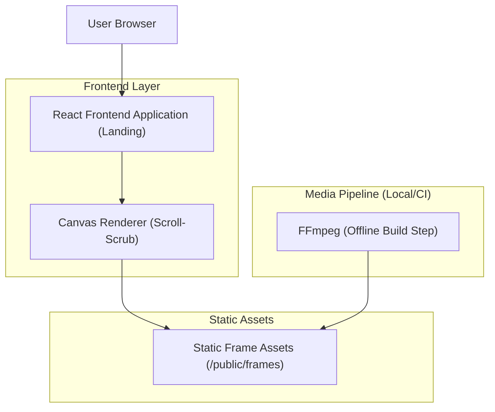

## 1.Architecture design

## 2.Technology Description
- Frontend: React@19 + react-router-dom@7 + framer-motion@12 + tailwindcss@3 + vite
- Backend: None
- Media pipeline (offline): FFmpeg (para gerar frames otimizados para scrub)

## 3.Route definitions
| Route | Purpose |
|---|---|
| / | Home (Landing) com Hero scroll-driven (canvas + frames) |
| /app | Registry/Marketplace (exploração) |
| /features | Página de features |
| /infrastructure | Página de infraestrutura |
| /register | Onboarding Builders (form em etapas) |
| /links | Links úteis |

## 4.API definitions (If it includes backend services)
Não aplicável (sem backend para o slider; assets são servidos como estáticos). 

## 6.Data model(if applicable)
Não aplicável.

### Notas essenciais do slider (implementação)
- O Hero usa trilho alto (ex.: `h-[300vh]`) + área `sticky` (`top-0`, `h-screen`) para garantir scrub até o final.
- Frames são servidos via `/public/frames/<pack>/frame_0001.jpg...` e desenhados em `<canvas>` com algoritmo de “cover” e `devicePixelRatio` limitado.
- Para acessibilidade/performance: `prefers-reduced-motion` deve renderizar apenas frame estático (sem scrub).