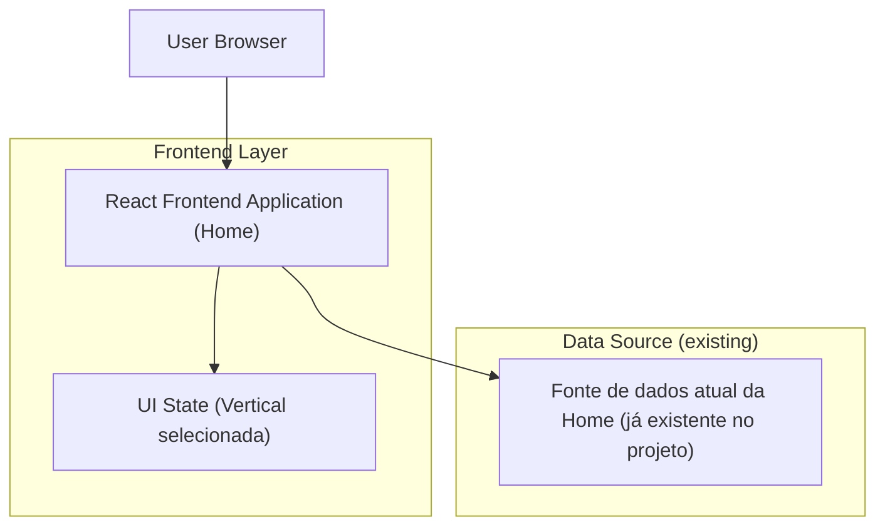

## 1.Architecture design

## 2.Technology Description
- Frontend: React (stack atual do projeto) + CSS (tokens/estilos atuais)
- Backend: None (não requerido para a reformulação visual/estrutural do slider)

## 3.Route definitions
| Route | Purpose |
|---|---|
| / | Home page, contém a seção “Agent Cards Marketplace” reformulada como slider de verticais |
