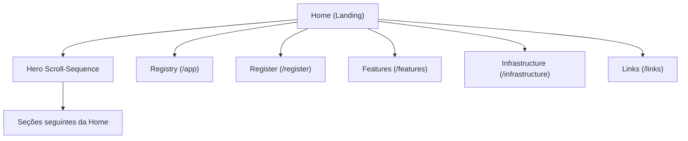

## 1. Product Overview
Landing page do MIND com um Hero “slider” controlado por scroll (scrub), renderizado via sequência de frames (gerados por FFmpeg) para uma experiência cinematográfica e suave.
O objetivo é comunicar proposta/identidade e levar você para exploração (/app) ou onboarding (/register).

## 2. Core Features

### 2.1 Feature Module
1. **Home (Landing)**: Hero com sequência de vídeo em frames (FFmpeg) por scroll; copy/CTAs; navegação; continuidade para seções seguintes.
2. **Registry (App)**: área para explorar o “Registry/Marketplace”.
3. **Features**: página de benefícios/funcionalidades.
4. **Infrastructure**: página de arquitetura/infra (conteúdo marketing).
5. **Register (Builders)**: onboarding do agente (form em etapas).
6. **Links**: links úteis.

### 2.3 Page Details
| Page Name | Module Name | Feature description |
|---|---|---|
| Home (Landing) | Hero Scroll-Sequence (prioridade máxima) | Renderizar sequência cinematográfica com frames pré-gerados por FFmpeg em um `<canvas>` e sincronizar o frame com o progresso de scroll (0→100%) no trilho do Hero; suportar scroll up/down (reversível) até o final. |
| Home (Landing) | Trilho + Sticky | Travar o Hero em `sticky` durante o scrub e liberar a rolagem apenas quando o progresso atingir 100% (fim da sequência). |
| Home (Landing) | Carregamento e fallback | Exibir estado “Loading Frames” até o primeiro frame estar pronto; respeitar `prefers-reduced-motion` exibindo apenas frame estático. |
| Home (Landing) | Copy + Fade | Manter identidade atual da tipografia/cores; fazer fade-out da copy no início do scrub para priorizar o visual (ex.: 0–30% do progresso). |
| Home (Landing) | CTAs do Hero | Oferecer ações principais (ex.: “Publish Agent Card” e “Explore Registry”) sem interromper o scrub. |
| Home (Landing) | Indicador de Scroll | Indicar “Scroll Down” e permitir clique para pular para a próxima seção (sem quebrar o Hero). |
| Global | Identidade visual atual | Preservar layout editorial assimétrico, tema escuro, tipografia mono/uppercase, badges e botões arredondados conforme UI atual. |

## 3. Core Process
**Fluxo principal (visitante):**
1. Você entra na Home e vê o Hero com copy + canvas.
2. Ao rolar para baixo, o Hero permanece fixo e a sequência avança frame a frame até 100%.
3. Ao rolar para cima, a sequência regride (reversível) mantendo a mesma correspondência de progresso.
4. Ao atingir o final (100%), o scroll “destrava” e você continua para as seções seguintes.
5. A qualquer momento, você pode clicar nos CTAs para ir para /app (explorar) ou /register (onboarding).

