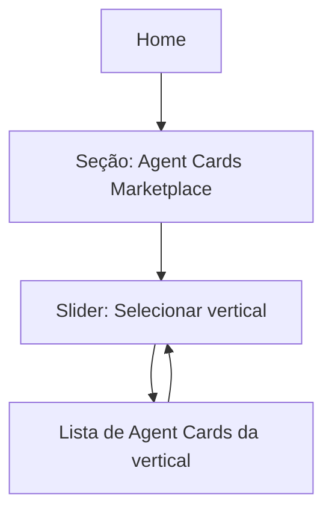

## 1. Product Overview
Reformular a seção “Agent Cards Marketplace” na Home para virar um slider por verticais.
Manter a identidade visual atual com brutalismo refinado (tipografia monoespaçada, sem ícones).

## 2. Core Features

### 2.1 Feature Module
Nossos requisitos consistem das seguintes páginas principais:
1. **Home**: seção “Agent Cards Marketplace” como slider de verticais; cards de agentes por vertical; navegação e legibilidade brutalista refinada.

### 2.3 Page Details
| Page Name | Module Name | Feature description |
|---|---|---|
| Home | Seção “Agent Cards Marketplace” (container) | Exibir a seção dentro da Home mantendo o posicionamento/identidade atuais. |
| Home | Slider de verticais | Alternar o contexto da seção por vertical via controle de slider (ex.: lista horizontal de verticais com rolagem e seleção). |
| Home | Cards de agentes por vertical | Exibir cards correspondentes à vertical selecionada, preservando a estrutura e conteúdo já existentes dos “Agent Cards”. |
| Home | Navegação do slider (sem ícones) | Permitir navegar entre verticais usando controles textuais (ex.: “Anterior/Próximo”) e/ou seleção direta pelo nome da vertical. |
| Home | Estilo “brutalismo refinado” | Aplicar tipografia monoespaçada, alto contraste e bordas/grades consistentes com o visual atual, sem uso de ícones. |

## 3. Core Process
Fluxo do usuário (Home):
1. Você acessa a Home e encontra a seção “Agent Cards Marketplace”.
2. Você navega pelas verticais no slider (seleção por nome e/ou controles textuais).
3. Ao mudar a vertical, a lista de Agent Cards exibida na seção é atualizada para aquela vertical.

