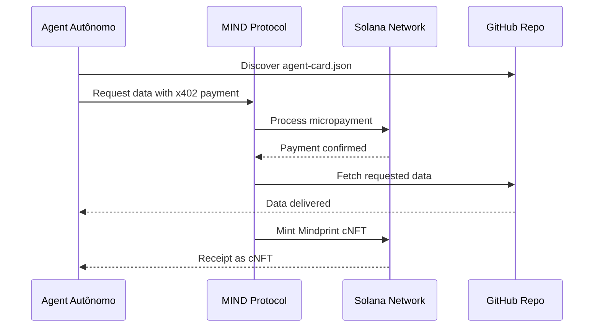

# Agent Card Specification v1.0

## 📋 Visão Geral
Agent Cards são documentos JSON que permitem que agentes autônomos descubram, entendam e consumam dados e serviços hospedados no GitHub como um marketplace A2A (Agent-to-Agent).

## 🎯 Propósito
Transformar repositórios GitHub em vitrines descobertáveis por:
- Agentes LangChain/CrewAI buscando dados
- Sistemas AutoGPT procurando APIs
- Tesourarias corporativas monetizando dados
- Pesquisadores compartilhando datasets

## 📦 Estrutura do JSON

```json
{
  "$schema": "https://mindprotocol.ai/schemas/agent-card/v1.json",
  "metadata": {
    "name": "string",
    "version": "string",
    "description": "string",
    "tags": ["string"],
    "license": "string",
    "author": {
      "name": "string",
      "contact": "string"
    }
  },
  "discovery": {
    "intent": "string",
    "category": "string",
    "keywords": ["string"],
    "compatibleFrameworks": ["string"]
  },
  "data": {
    "type": "dataset|api|model|service",
    "format": "string",
    "schema": {
      "fields": [
        {
          "name": "string",
          "type": "string",
          "description": "string"
        }
      ]
    },
    "samples": ["string"],
    "qualityScore": 0.95
  },
  "access": {
    "authentication": "none|bearer|x402",
    "endpoints": {
      "discovery": "string",
      "metadata": "string",
      "data": "string",
      "payment": "string"
    },
    "rateLimit": {
      "requests": 100,
      "per": "minute"
    }
  },
  "pricing": {
    "model": "free|per_request|subscription",
    "currency": "USDC|SOL",
    "price": 0.1,
    "x402Endpoint": "string"
  },
  "provenance": {
    "source": "string",
    "createdAt": "2024-01-01T00:00:00Z",
    "updatedAt": "2024-01-01T00:00:00Z",
    "signature": "string"
  }
}
```

## 🏷️ Campos Obrigatórios

### metadata
- `name`: Nome único do recurso
- `version`: Versão semântica (ex: 1.0.0)
- `description`: Descrição clara do que o recurso oferece
- `tags`: Categorias para descoberta
- `license`: Licença de uso (MIT, Apache-2.0, etc)

### discovery  
- `intent`: Propósito principal (data_analysis, model_training, etc)
- `category`: Categoria geral (finance, healthcare, research)
- `keywords`: Palavras-chave para busca
- `compatibleFrameworks`: Frameworks suportados

### data
- `type`: Tipo do recurso (dataset, api, model, service)
- `format`: Formato dos dados (JSON, CSV, Parquet, etc)
- `schema`: Estrutura dos dados (opcional para APIs)

## 🔐 Modelos de Acesso

### 1. Acesso Livre (Free)
```json
{
  "authentication": "none",
  "pricing": { "model": "free" }
}
```

### 2. Micropagamentos x402
```json
{
  "authentication": "x402",
  "pricing": {
    "model": "per_request",
    "currency": "USDC",
    "price": 0.01,
    "x402Endpoint": "https://api.mindprotocol.ai/x402/payment"
  }
}
```

### 3. Assinatura
```json
{
  "authentication": "bearer",
  "pricing": {
    "model": "subscription", 
    "currency": "USDC",
    "price": 99.00
  }
}
```

## 🎯 Categorias de Intent

| Categoria | Descrição | Exemplo |
|-----------|-----------|---------|
| `data_analysis` | Dados para análise | Market data, analytics |
| `model_training` | Dados para treino ML | Training datasets |
| `api_integration` | APIs para consumo | Financial APIs |
| `orchestration` | Serviços de orquestração | Workflow automation |
| `knowledge_base` | Bases de conhecimento | Research papers |

## 🔍 Discovery Mechanism

Agentes descobrem Agent Cards através de:

1. **GitHub Repository Scanning**
   - Busca por arquivos `agent-card.json`
   - Indexação por tags e keywords

2. **MIND Discovery API**
   ```bash
   GET https://discovery.mindprotocol.ai/cards?q=financial+data
   ```

3. **Framework Integration**
   - Plugins nativos para LangChain/CrewAI
   - Auto-discovery durante agent initialization

## 💰 Payment Flow (x402)



## 🛡️ Security Considerations

- **Signature Verification**: Agent Cards devem ser assinados digitalmente
- **Rate Limiting**: Prevenção de abuse através de limites configuráveis  
- **Data Provenance**: Rastreabilidade completa da origem dos dados
- **Payment Security**: Transações atômicas via Solana

## 📊 Quality Metrics

- `qualityScore`: Score de qualidade (0.0-1.0)
- `updateFrequency`: Frequência de atualização
- `completeness`: Completeza dos dados (%)
- `accuracy`: Precisão medida

## 🔄 Versioning

- Versões seguem Semantic Versioning (MAJOR.MINOR.PATCH)
- Breaking changes requerem major version update
- Agentes devem validar compatibilidade de versão

## 📈 Adoption Guidelines

1. **Para Data Providers**:
   - Crie `agent-card.json` na raiz do repositório
   - Use tags relevantes para descoberta
   - Defina pricing model apropriado

2. **Para Agent Developers**:
   - Implemente MIND discovery client
   - Adicione x402 payment handling
   - Valide Agent Cards antes do uso

## 🚀 Getting Started

### 1. Create Agent Card
```bash
curl -X POST https://api.mindprotocol.ai/cards \
  -H "Content-Type: application/json" \
  -d @agent-card.json
```

### 2. Discover Available Cards
```bash
curl "https://discovery.mindprotocol.ai/cards?tags=finance&type=dataset"
```

### 3. Consume Data with Payment
```javascript
const mindClient = new MINDClient();
const card = await mindClient.discover('financial data');
const data = await mindClient.consume(card, { payment: 'x402' });
```

## 📝 License

Este specification é licenciado sob Apache License 2.0. Agent Cards individuais podem ter suas próprias licenças especificadas no campo `metadata.license`.